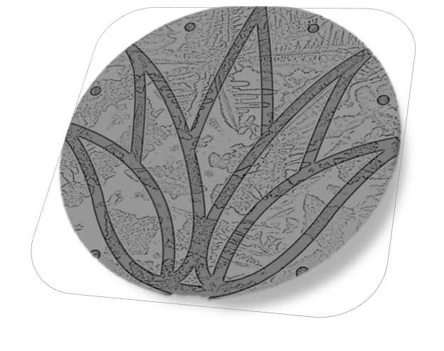

# SpiritVision 
AI-based multi-class image classification tool focused on improving Mezcal production quality control and ensuring compliance with industry regulations. Built using OpenCV, PyTorch, and FastAI, SpiritVision uses images of evaporated mezcal drops captured under a microscope to quickly identify excess methanol levels and recognize different mezcal strains. Web App deployed on [HuggingFace Spaces](https://huggingface.co/spaces/salgadev/spiritvision-demo).


## Background
Mezcal has a very strict and exhaustive quality control authentication and certification method in which traditionally, gas chromatography and mass spectrometry techniques analyze volatile compounds in order to recognize methanol spikes. Both these approaches take days to even weeks, are expensive, and unfeasible for widespread adoption among small-scale producers.

## Objective
Developing an accesible deep learning model capable of detecting spikes in methanol concentration in mezcal by training ResNet models using transfer learning and sampled mezcal droplets inspected under a microscope. The application can facilitate routine quality verifications while reducing operational costs and improving competitiveness of small to medium producers. 

## Technologies used
- [OpenCV](https://opencv.org/)
- [PyTorch](https://pytorch.org/)
- [fastai](https://www.fast.ai/) 

## Local Setup
1. Get and install [Python](https://www.python.org/downloads/) and an IDE of your choice
   (e.g. [PyCharm](https://www.jetbrains.com/pycharm/download/) or [Spyder](https://www.spyder-ide.org/))
2. Make a virtual environment -- *will depend on your IDE* -- (Optional)
3. Install dependencies, for example, using the terminal
    ```
    pip install -r requirements.txt
    ```
4. Try the Notebooks directory and/or the training script

## Collaborating
- Feel free to fork the repo and submit a [Pull Request](https://github.com/socd06/mezcal/compare).
- If you don't have previous experience, please review [How to submit a pull request](https://www.freecodecamp.org/news/how-to-submit-a-pull-request-529efe82eea5/) and comment on any [Issues](https://github.com/socd06/mezcal/issues) you would like to collaborate.
- Contact [Carlos](mailto:csalgado@uwo.ca) or [Angel](mailto:Angel.reyes@cimat.mx) if you would like to be invited to the Discord chat

## References
- [NOM-070-SCFI-2016, Bebidas alcohólicas-Mezcal-Especificaciones](https://dof.gob.mx/nota_detalle.php?codigo=5472787&fecha=23/02/2017#gsc.tab=0)
- [Revisión del Agave y el Mezcal](https://www.redalyc.org/journal/776/77645907016/) 
- [VOLATILE COMPONENTS IN MEZCAL - Revista Mexicana de Ingeniería Química](https://www.redalyc.org/pdf/620/62060106.pdf)



